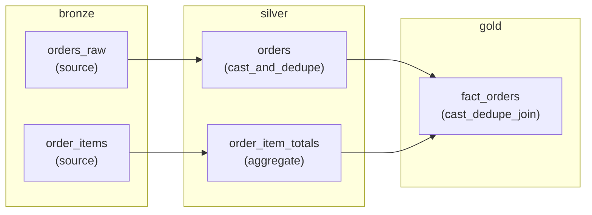

# Metadata-driven, incremental pipeline generator (POC)

## The problem this solves

The original process was **linear**: metadata goes in, an AI agent writes all the
pipeline/notebook code in one shot, and you hope it's correct end to end. That's fine
for a first build. It breaks down the moment you need to *change* something:

- Every update re-runs the whole thing, so a small change risks silently altering
  code that was already correct and tested.
- Hand-patching generated code to avoid that risk means the metadata stops being the
  real source of truth — the code and the metadata drift apart.
- There's no way to know *how much* of the pipeline is actually affected by a given
  metadata change, so "regenerate everything" becomes the only safe-feeling option,
  which is slow and token-expensive.

This POC replaces "regenerate everything, from a fresh prompt, every time" with a
**compiler model**: metadata is versioned source code, and generation is a build step
that only touches what actually changed.

## Core idea

1. **Metadata is the only source of truth**, and it's diffable (it's just JSON files).
2. Every metadata object records what it **depends on**. That's a dependency graph,
   for free, with no extra bookkeeping.
3. When metadata changes, we don't regenerate everything — we compute the **blast
   radius**: the changed object(s) plus everything downstream of them in the
   dependency graph.
4. Only objects in the blast radius are regenerated. Generation of an object is still
   a clean, one-shot build from its own metadata — so it's **idempotent** (same
   metadata in, same code out), it just isn't run unnecessarily.
5. **AI reasoning is isolated to one small, bounded step**: picking a transformation
   template and extracting its parameters from metadata. It never writes pipeline
   code freehand. Turning that selection into actual code is a deterministic script —
   zero tokens, zero hallucination risk, at that step.

This is why the design directly addresses both of your original asks — "make updates
safe/incremental" and "cut token use and hallucinations" — with one architecture, not
two.

## Usage: what to run every time metadata changes

Every time you add, remove, or edit anything under `metadata/`, this is the full
cycle, in order, from inside `poc/`:

1. **`python run.py diff`**
   Computes the blast radius (metadata changes *and* template changes — see
   "Hash manifest" below) and prints it, split into up to three groups:
   - **source objects with changed metadata** — nothing to generate.
   - **objects requiring the AI skill** — metadata changed, or the object is new.
   - **objects that only need regeneration** — only the *template* changed; the
     existing selection is still valid, so no AI call is needed at all.
   If it prints *"No changes detected"*, stop here — nothing to do.

2. **`python run.py graph`** *(optional but recommended)*
   Writes `blast_radius.md` so you can see exactly what's about to be touched —
   red = changed, yellow = downstream of a change, green = untouched — before you
   commit to regenerating anything.

3. **Run the commands `diff` just printed, only for the "requiring the AI skill"
   group.** `diff` prints the exact command, e.g.:
   ```
   /select-pipeline-template gold.fact_orders   # metadata changed + template 'cast_dedupe_join' changed
   ```
   The reason after `#` can list more than one cause — metadata and template can
   both be stale on the same object at once, and both are reported, not just
   whichever was checked first.
   Run each one in a Claude Code session whose working directory is `poc/` (or a
   subdirectory of it — required for a project-scoped skill to be discovered at
   all). This is the only step that uses AI, and it only ever writes one file per
   object: `selections/<object_id>.selection.json`.
   Objects under "source objects" get no command (no `transformation` block).
   Objects under "only need regeneration" also get no command — skip straight to
   step 4 for those.

4. **`python run.py generate`**
   Deterministically turns every selection file into code under `generated/`, and
   rewrites `manifest/hash_manifest.json` to match the metadata just built.

5. **`python run.py diff`** again, to confirm it now reports *"No changes detected."*
   That's how you know the loop actually closed.

Repeat this same five-step cycle regardless of what kind of change it was — a brand
new object, a schema change on an existing one, or a changed transformation. The
cycle doesn't change; only how many objects show up in step 1 does.

## Directory structure

```
poc/
  metadata/
    bronze/orders_raw.json          source: orders, schema only, no transformation
    bronze/order_items.json         source: order line items, schema only
    silver/order_item_totals.json   derived: aggregate of order_items, grain order_id
    gold/fact_orders.json           derived: joins orders_raw + order_item_totals
  manifest/
    hash_manifest.json            per object_id: {metadata_hash, template, template_hash}
  templates/
    registry.json                 catalog of available templates + their param schemas
    cast_and_dedupe.py.tmpl       single-source cast + dedupe (try/except + run logging built in)
    aggregate.py.tmpl             single-source group-by + agg (sum/count/avg/min/max)
    cast_dedupe_join.py.tmpl      cast + dedupe a primary source, left-join in a secondary source
  selections/
    <object_id>.selection.json    output of the AI skill: {template, params, justification}
  build/
    diff_engine.py                hashes metadata + templates, computes the blast radius (no AI)
    generator.py                  turns a selection.json into generated code (no AI)
    visualize.py                  renders the blast radius as a Mermaid graph (no AI)
    blast_radius.json             blast radius from the last `python run.py diff`
  generated/
    <object_id>.py                the final, generated pipeline code
  lib/
    run_logger.py                 shared log_run() used by every generated notebook (no AI, no template)
  control/
    run_log.jsonl                 runtime metadata layer: one JSON line per notebook run
  .claude/skills/select-pipeline-template/SKILL.md
                                   the one AI-reasoning step, scoped to this project
  run.py                          orchestrates diff -> graph -> (skill) -> generate
  blast_radius.md                 Mermaid visualization of the current blast radius
```

## How it works, piece by piece

### 1. Metadata (`metadata/`)

Each object is one JSON file. A **source** object (`bronze.orders_raw`) just declares
its schema. A **derived** object (`gold.fact_orders`) additionally declares:

- `depends_on`: which objects feed it — this *is* the dependency graph. It's a list,
  not a single value: `gold.fact_orders` depends on two objects now (see below).
- `transformation`: a `type` (e.g. `cast_and_dedupe`, `aggregate`, `cast_dedupe_join`),
  a `grain`, and a plain-English `logic_description`. This is what the AI skill reads
  to pick a template and fill in parameters — it is never asked to invent
  transformation logic itself.

```json
// metadata/gold/fact_orders.json
{
  "object_id": "gold.fact_orders",
  "depends_on": ["silver.orders", "silver.order_item_totals"],
  "transformation": {
    "type": "cast_dedupe_join",
    "logic_description": "dedupe silver.orders on order_id keeping the latest row by order_date (already cast upstream, no further casts needed here), then left join silver.order_item_totals on order_id to add total_quantity, total_amount, item_count",
    "grain": "order_id"
  },
  "columns": [...]
}
```

Both of `fact_orders`'s dependencies are themselves derived — `silver.orders` is
`bronze.orders_raw` cast + deduped (reusing `cast_and_dedupe` exactly as-is), and
`silver.order_item_totals` is `bronze.order_items` aggregated (`type: "aggregate"`).
So the graph is two hops deep on *both* sides now — `gold.fact_orders` never reaches
past `silver/` back to `bronze/` directly, which is what proper medallion layering
means in practice here: it's not a rule the system enforces, it's just what
`depends_on` happens to say once every object points at its immediate upstream
rather than skipping ahead.

**Current object graph, across all three layers:**



Note this diagram shows *structure* (which objects exist and how they connect,
labeled with the template each one uses) — it doesn't change as you build and
regenerate. `blast_radius.md` (from `python run.py graph`) shows the same edges but
color-coded by current build *state* (changed/propagated/untouched); this one is the
static map, that one is the live one.

### 2. Hash manifest (`manifest/hash_manifest.json`)

After every successful generation, each object gets one manifest entry:

```json
"gold.fact_orders": {
  "metadata_hash": "186989d8...",
  "template": "cast_and_dedupe",
  "template_hash": "a73916a3..."
}
```

Two independent things are tracked, because two independent things can make a
generated file stale: the object's own metadata (canonical JSON, SHA-256), and the
content of the specific template file it was built with (`template` records *which*
template, so the diff engine knows which file to re-hash). This is the *only* state
the system remembers between runs — no conversation history, no accumulated context,
just "what did the metadata look like, and what did the template look like, last time
this was built successfully."

### 3. Diff engine (`build/diff_engine.py`) — deterministic, no AI

There's no caching or memoization anywhere in this: every metadata file and every
template file gets re-read off disk and re-hashed from scratch on *every* `python
run.py diff` — `hash_object()` (canonical JSON, SHA-256) for a metadata dict,
`hash_file()` (raw bytes, SHA-256) for a template. The only thing carried between
runs is what's already sitting in `manifest/hash_manifest.json` from the last
successful `generate`. So, for every object:

1. Compare its current metadata hash against the manifest's `metadata_hash`.
2. Independently — not "else if" — look up which template its last selection used,
   and compare *that template file's* current hash against the manifest's
   `template_hash`. Both checks always run; metadata being unchanged doesn't skip the
   template check, and vice versa.
3. Either mismatch → the object is `changed_or_new`. `change_reason()` reports *all*
   reasons that actually apply, not just the first one found — an object can be
   `"metadata changed + template 'cast_dedupe_join' changed"` at the same time (this
   was a real bug: it used to return early on the first match and silently hide the
   second). Objects pulled into the blast radius purely by depends_on propagation —
   not themselves changed — get a different, fixed label instead
   (`"pulled in via depends_on"`) when `run.py diff` prints them; calling
   `change_reason()` on an object that isn't itself in `changed_or_new` would return
   the misleading `"unchanged"`. A separate helper, `only_template_changed()`, answers
   the narrower yes/no question `run.py` actually needs for routing (skip-the-skill
   eligibility) — it doesn't parse `change_reason()`'s text, since that can now
   contain multiple reasons.
4. Build the **reverse** dependency graph (`object -> things that depend on it`) from
   every `depends_on` field.
5. Starting from `changed_or_new`, walk the reverse graph forward (breadth-first) to
   pull in everything downstream. The result is the **blast radius**.
6. Split the blast radius into three groups (see "Usage" above): source objects,
   objects that need the AI skill, and objects that only need regeneration (template
   changed, metadata didn't — the existing selection is still valid by construction,
   since it was derived from metadata that hasn't moved).

This means a schema change to `bronze.orders_raw` correctly pulls `gold.fact_orders`
into the blast radius even if `fact_orders`'s own transformation logic didn't change —
because something upstream of it did, and that might matter. And it means editing a
*template* (e.g. adding a try/except, changing how errors are logged) correctly flags
every object built from it, even though no metadata moved at all — the same class of
problem as "a data object's schema changed," just with a template file as the thing
being depended on instead of another data object.

### 4. Template library (`templates/`)

`registry.json` is the catalog: each template's `matches_transformation_type` (which
`transformation.type` values it covers) and its `params_schema` (what parameters it
needs, and what each one means). Each `.py.tmpl` is the actual code, with
`$placeholders` (Python `string.Template` syntax) for the parts that vary per object.

Three templates exist so far:
- **`cast_and_dedupe`** — single source, cast + dedupe on a key.
- **`aggregate`** — single source, `groupBy` + one aggregate per output column
  (`sum`/`avg`/`min`/`max`/`count`). No computed expressions — each aggregate is one
  Spark agg function over one existing source column (or a bare row count), which is
  why `bronze.order_items` carries a pre-computed `line_amount` column rather than the
  template (or the skill) ever multiplying `quantity * unit_price` itself.
- **`cast_dedupe_join`** — the same cast + dedupe as above on a *primary* source, then
  a left-join of a *secondary* source (typically an `aggregate` output) on a shared
  key. This is what lets `gold.fact_orders` depend on two objects instead of one.
  Optionally also computes **derived columns** post-join, via `derived_columns` — but
  from a closed set of ops (`_DERIVED_OPS` in `build/generator.py`), never a freeform
  expression: `{"customer_location": {"op": "concat", "source_cols": ["city", "country"],
  "separator": ", "}}` renders to
  `F.concat_ws(", ", F.col("city"), F.col("country"))`. Same principle as `agg_map`'s
  closed set of Spark functions — the skill picks an op and names columns, it never
  writes the expression itself, and the generator independently validates every
  `source_col` actually exists on one side of the join before rendering anything.

Templates are meant to be small in number, hand-reviewed, and reused across many
objects — the "vetted library" that makes per-object generation cheap and safe.

### 5. The AI step — `select-pipeline-template` skill

This is the **only** place an LLM does any reasoning, and its job is deliberately
narrow: given one `object_id`, read its metadata (and its dependencies' metadata),
read the template registry, and output one small JSON file —

```json
{
  "object_id": "gold.fact_orders",
  "template": "cast_and_dedupe",
  "params": {
    "source_table": "bronze.orders_raw",
    "key_cols": ["order_id"],
    "order_col": "order_date",
    "cast_map": {"amount": "decimal(18,2)"}
  },
  "justification": {
    "source_table": "depends_on[0]",
    "key_cols": "transformation.grain",
    "order_col": "transformation.logic_description: 'keep latest by order_date'",
    "cast_map": "transformation.logic_description: 'cast amount to decimal(18,2)'"
  }
}
```

It writes this to `selections/<object_id>.selection.json` and stops. It does not
write Python. It does not touch any file outside `selections/`. If no template in the
registry matches the object's `transformation.type`, it's required to say so instead
of guessing — that's the designed fallback point for "this needs a genuinely new
template," which is a human-in-the-loop event, not a silent generation.

This is what keeps token cost low (one small structured JSON per object, not a full
script) and keeps hallucination surface small (the model can only select from
pre-vetted templates and fill declared parameters, with every parameter traceable to
a specific metadata field).

### 6. Generator (`build/generator.py`) — deterministic, no AI

Takes a `selection.json`, loads the template it names, and renders it. Because the
three templates have genuinely different params shapes (one source vs. a group-by vs.
a primary+join pair), there's no single validation function that fits all of them —
instead, each template has its own **context builder**:
`_cast_and_dedupe_context`, `_aggregate_context`, `_cast_dedupe_join_context`,
dispatched by template name through `TEMPLATE_CONTEXT_BUILDERS`. Adding a fourth
template later means writing one more builder function and registering it — nothing
else in the generator, the diff engine, or `run.py` needs to change.

Every builder does the same two things, just with template-appropriate checks:

1. **Validates** — every column any param references (a cast, a group-by column, a
   join key, an aggregate's source column) must actually exist where it's read from;
   every column the *target* declares must be traceable to something the template can
   actually produce (e.g. `cast_dedupe_join` allows a target column to come from
   either the primary or the join side — but not from nowhere). A mismatch aborts
   generation rather than producing code that silently drops or leaks columns
   relative to the declared schema.
2. **Renders** — substitutes the parameters into the template, including things the
   generator derives itself rather than leaving to the AI selection: an explicit
   final `.select(...)` of exactly the target's declared columns (there's nothing
   ambiguous about "what columns does this object have," so it isn't left for the
   skill to guess), and `object_id` + `metadata_hash` for the run-logging call every
   template includes (see below) — again, unambiguous from metadata, no AI decision
   involved. Writes the result to `generated/<object_id>.py`.

No LLM call happens in this step. Same selection in → same code out, every time.

### 7. Run logging (`lib/run_logger.py` + `control/run_log.jsonl`)

This is a second, different kind of metadata layer from everything above — it's
**runtime** metadata (what actually happened when a notebook ran), not **design-time**
metadata (what should be built). It's append-only and high-volume by nature, so it
lives in its own store, `control/run_log.jsonl`, rather than being versioned inside
`metadata/`.

`lib/run_logger.py` exports one function, `log_run(run_id, object_id, version,
started_at, status, rows_processed, error_message)`, which appends one JSON line per
call. `templates/cast_and_dedupe.py.tmpl` now wraps its whole body in try/except and
calls it exactly once per run — once on success (with `rows_processed`), once on
failure (with `error_message`) — so every notebook run leaves exactly one record,
regardless of outcome:

```python
try:
    ...
    log_run(run_id=run_id, object_id="gold.fact_orders", version="186989d8...",
            started_at=started_at, status="success", rows_processed=df.count())
    return df
except Exception as exc:
    log_run(run_id=run_id, object_id="gold.fact_orders", version="186989d8...",
            started_at=started_at, status="error", error_message=f"{type(exc).__name__}: {exc}")
    raise
```

`version` is the object's metadata content hash — the same hash the diff engine
already computes — so any run log entry can be traced back to the exact metadata
state that produced it, for free, without inventing a separate version number.

This is deliberately **not** a template and **not** AI-generated: `log_run()` is
called the exact same way for every object, with no per-object decision to make, so
it's written once as shared infrastructure and reused everywhere. It's a different
extension mechanism than adding a new transformation template — it demonstrates
adding a cross-cutting concern (logging) rather than a new per-object behavior, which
in practice (adding retries, metrics, alerting, etc.) is at least as common a way
real systems get extended.

### 8. Impact-radius graph (`build/visualize.py`)

`python run.py graph` renders the dependency graph as a Mermaid flowchart in
`blast_radius.md`, color-coded from the same diff logic used by `run.py diff`:

- 🔴 red — metadata changed, template changed, or the object/template is new (a
  direct hit)
- 🟡 yellow — unchanged itself, pulled in only because something it `depends_on`
  changed (propagated impact) — only applies to data objects, never to templates
- 🟢 green — untouched, hash matches the manifest, nothing to regenerate

**Templates are drawn as their own nodes**, rounded and connected by dashed lines to
whichever objects currently use them (per each object's `selections/*.json`) — a
visually distinct kind of edge from the solid `depends_on` lines between data objects.
A template node goes red if its file hash doesn't match what's recorded in the
manifest for *any* object using it. This was added after a real gap: template changes
were already tracked correctly (see "Diff engine" above), but were invisible in the
diagram itself — an object could go red purely because its template changed, with no
visual indication of *why*. The summary block also gets a dedicated
`**Templates changed:** <names>.` line when applicable.

This is a pure read-over-the-same-state view (metadata + templates +
`hash_manifest.json`) — it doesn't compute anything the diff engine doesn't already
compute, it just makes the blast radius (now including template drift) visible before
you commit to regenerating anything.

### 9. Orchestration (`run.py`)

```
python run.py diff       # compute + persist the blast radius, print what needs the skill
python run.py graph      # render the current blast radius as blast_radius.md (Mermaid)
python run.py generate   # run the deterministic generator over every generation
                          # target in the blast radius, then update the hash manifest
```

See **"Usage: what to run every time metadata changes"** above for the full cycle.

## Walkthrough: what we actually ran

This exact sequence was executed against the two tables in this repo, in order:

1. **Cold start.** Manifest was empty. `diff` flagged both `bronze.orders_raw`
   (source, no generation needed) and `gold.fact_orders` (generation target).
2. **Selection.** A `selections/gold.fact_orders.selection.json` was produced
   (selecting the `cast_and_dedupe` template, per the JSON shown above).
3. **Generate.** `python run.py generate` validated the selection against both
   objects' metadata, rendered the template, and wrote
   `generated/gold_fact_orders.py`:

   ```python
   def build_fact_orders(spark):
       df = spark.table("bronze.orders_raw")

       df = df.withColumn("amount", F.col("amount").cast("decimal(18,2)"))

       window = Window.partitionBy("order_id").orderBy(F.col("order_date").desc())
       df = df.withColumn("_rn", F.row_number().over(window)).filter(F.col("_rn") == 1).drop("_rn")

       return df
   ```

   The manifest was updated with both objects' hashes.
4. **Idempotency check.** Running `diff` again immediately reported *"No changes
   detected"* — proving the system doesn't regenerate anything unless metadata
   actually changed.
5. **Upstream schema change.** A `currency` column was added to
   `metadata/bronze/orders_raw.json` — `fact_orders`'s own transformation logic was
   untouched. `diff` correctly flagged `bronze.orders_raw` as a changed source *and*
   pulled `gold.fact_orders` back into the generation targets, purely via the
   `depends_on` edge — proving the blast-radius propagation works, not just direct
   hash comparison.
6. **A pass-through column exposed a real gap.** A `country` column was added to
   *both* `orders_raw` and the declared target schema of `fact_orders`. The existing
   selection was still valid (no template/param decision had changed), so
   `python run.py generate` was re-run as-is — which showed the template had no
   explicit final column selection: it would have silently carried `customer_id` and
   `currency` through too, even though they aren't in `fact_orders`'s declared schema.
   Fixed by deriving the final `.select(...)` from the target's own metadata (not
   from the AI selection) and adding a generator-side check that every declared
   target column is actually traceable to the source. Re-running `generate` confirmed
   the fix: output now matches the declared schema exactly.
7. **Impact-radius graph.** `build/visualize.py` was added on top of the same
   diff/manifest state (no new computation). Verified live: bumping
   `bronze.orders_raw`'s `version` field turned it red and `gold.fact_orders` yellow
   in `blast_radius.md`; reverting the edit brought both back to green.
8. **Selection file reset for a real skill test.** The hand-written
   `selections/gold.fact_orders.selection.json` (used through steps 2-7 to prove the
   generator side) was deleted, and a Claude Code session rooted at `poc/` was used
   to run `/select-pipeline-template gold.fact_orders` for real.
9. **The real skill test passed.** It reproduced essentially the same selection —
   same `source_table`, `key_cols`, `order_col`, `cast_map`, correctly re-derived
   from the (by then updated) `logic_description` text — with no priming from this
   conversation. First real end-to-end proof that the AI step stays bounded.
10. **Template-hash tracking added.** Until now, `diff` only hashed `metadata/`, so
    editing a template silently went undetected — `diff` would say "No changes"
    even though every object built from that template was now stale. Fixed by
    recording a `template_hash` per object in the manifest (alongside
    `metadata_hash`), resolved via that object's own `selections/*.json` (which
    records *which* template it used). `diff` output was also split into two
    groups: objects that need the AI skill vs. objects that only need
    regeneration (template changed, metadata didn't, so the existing selection is
    still valid — skip the skill entirely).
11. **Run-logging layer added.** `lib/run_logger.py` (`log_run()`, shared, not
    templated) plus `control/run_log.jsonl` as the runtime-metadata store.
    `cast_and_dedupe.py.tmpl` now wraps its body in try/except and logs
    `run_id`, `object_id`, `version` (the metadata hash), `status`, and either
    `rows_processed` or `error_message`.
12. **Proved template-only propagation for real.** With metadata untouched, the
    template's error-message line was edited. `diff` correctly listed
    `gold.fact_orders` under *"only need regeneration... no skill call needed"* —
    not under *"requiring the AI skill"* — confirming the fix in step 10 actually
    works for the exact scenario that motivated it (e.g. adding try/except to a
    template later).
13. **`log_run()` verified independently.** Since `pyspark` isn't installed in this
    environment, the generated notebooks can't actually execute here — but
    `log_run()` itself is plain Python with no Spark dependency, so it was called
    directly (one success case, one error case) and both landed correctly in
    `control/run_log.jsonl`.
14. **Aggregation + join added.** `bronze.order_items` (new source) and
    `silver.order_item_totals` (new `aggregate`-template object, grain `order_id`)
    were added; `gold.fact_orders` was changed to `depends_on` both
    `bronze.orders_raw` and `silver.order_item_totals`, via a new
    `cast_dedupe_join`-template transformation. `generator.py` was restructured
    around one context-builder function per template (see "Generator" above), since
    a single hardcoded validator no longer fit three different params shapes.
15. **Zero changes needed outside the data/template layer.** `diff_engine.py`,
    `run.py`, and `visualize.py` were untouched by step 14 — `python run.py diff`
    correctly found the new 3-object graph and printed both new objects as
    "requiring the AI skill" the moment the metadata landed, purely because the
    reverse-`depends_on`-graph walk is generic. That's the actual payoff being
    tested: extending the data/template side doesn't require touching the build
    side.
16. **Generated output verified.** Selections were written for both new objects
    (`aggregate` for `order_item_totals`, `cast_dedupe_join` for `fact_orders`),
    `python run.py generate` produced correct code for both — the join uses
    `how="left"` and the final `.select(...)` correctly spans columns from both
    `bronze.orders_raw` and `silver.order_item_totals` — and a repeat `diff`
    confirmed idempotency.
17. **2-hop propagation proved live, and a real bug found in the process.** Bumping
    `bronze.order_items`'s version correctly propagated through
    `silver.order_item_totals` into `gold.fact_orders` (two hops), while
    `bronze.orders_raw` — unrelated to that branch of the graph — stayed untouched.
    But the printed reason for the two propagated objects said `"unchanged"`,
    which is nonsensical next to a command telling you to regenerate them:
    `change_reason()` is only meaningful for objects that are themselves in
    `changed_or_new`, and these two were only in the blast radius via propagation.
    Fixed in `run.py` with a `reason_for()` wrapper that labels propagated objects
    `"pulled in via depends_on"` instead of calling `change_reason()` on them.
18. **`silver.orders` added — reusing a template, not writing a new one.** A cleaned
    copy of `bronze.orders_raw` was added to `silver/`, using `cast_and_dedupe`
    completely unchanged — the same template `fact_orders` already used, just for a
    different object at a different layer. Concrete proof that templates are keyed
    to `transformation.type`, not to layer or object.
19. **`gold.fact_orders` rewired onto proper medallion layering.** `depends_on`
    changed from `["bronze.orders_raw", "silver.order_item_totals"]` to
    `["silver.orders", "silver.order_item_totals"]`; `primary_cast_map` in its
    selection became `{}` since casting now already happened in `silver.orders` (no
    double-casting). `diff` correctly scoped the resulting blast radius to exactly
    `silver.orders` (new) and `gold.fact_orders` (metadata changed) —
    `silver.order_item_totals`, untouched by this change, correctly stayed out of it.
    Both regenerated correctly; repeat `diff` confirmed clean.
20. **`derived_columns` added to `cast_dedupe_join`.** Motivated by a genuine gap: no
    template could produce a computed column like "concatenate city and country."
    Added as a closed-set op (`concat` today, more addable later) rather than a
    freeform expression, consistent with how `agg_map` already worked — the generator
    validates every `source_col` exists on one side of the join before rendering
    anything, exactly like every other param.
21. **`customer_location` defined on `fact_orders`, `diff`-only (no `generate`).**
    Metadata updated with the new column + an updated `logic_description`; `diff`
    correctly scoped this to just `gold.fact_orders` (`"metadata changed"`) — neither
    `silver.orders` nor `silver.order_item_totals` moved, so neither showed up.
    Nothing was generated or selected at this point, by request — this step was
    purely "prove `diff` reacts correctly to a metadata-only change," decoupled from
    actually building anything.
22. **A real bug found by inspection, not by a live test this time.** Looking at the
    `diff` output from step 21, `change_reason()` was only ever reporting "metadata
    changed" — even though the `cast_dedupe_join` template had *also* changed in step
    20. It returned early on the first match instead of checking both. Fixed by
    making it collect every applicable reason instead of returning on the first;
    added `only_template_changed()` as a precise boolean helper so `run.py`'s
    skip-the-skill routing logic didn't have to parse a now-potentially-combined
    reason string. Verified: the same object now reports
    `"metadata changed + template 'cast_dedupe_join' changed"`.
23. **Templates added as nodes to `blast_radius.md`.** Until now the diagram only
    showed data objects — a template change was correctly detected (per step 22) but
    invisible in the graph itself. `build/visualize.py` now draws each template as a
    rounded node, dashed-linked to every object currently using it, colored red if
    its file hash doesn't match what's recorded for any of them. Verified live:
    `template_cast_dedupe_join` rendered red, dashed-linked to `gold.fact_orders`,
    with a `**Templates changed:** cast_dedupe_join.` line in the summary.

## Why this addresses token cost and hallucination specifically

- **Tokens**: the AI step never emits a full script — only a small JSON object
  (template name + a handful of parameters). All the verbose code (imports, window
  functions, error handling) lives once in the template, reused across every object
  that matches, and costs zero tokens per regeneration.
- **Hallucination containment**: the model can't invent join logic, column names, or
  cast expressions from nothing — it can only select from a pre-approved template and
  fill parameters it can point back to a specific metadata field (`justification`).
  The generator then independently re-validates those parameters against the actual
  metadata before writing any code, so even a wrong selection can't silently produce
  code referencing a nonexistent column.
- **Blast radius scoping**: because regeneration is scoped to what actually changed
  (plus what's downstream), most runs touch one or two objects, not the whole
  pipeline — so the token/hallucination savings compound instead of being paid fresh
  on every single update.

## Extending the system

- **New object (additive change)**: add its metadata file with a `depends_on`. Next
  `diff` will flag it as new; nothing else regenerates.
- **Changed transformation on an existing object**: edit its `transformation` block.
  `diff` flags it and everything downstream.
- **New transformation shape not covered by any template**: the skill will refuse to
  guess and report the gap. At that point a human (or a separate, more expensive
  free-form generation + heavier review pass) adds a new template to
  `templates/registry.json` + a new `.py.tmpl`, plus one context-builder function in
  `build/generator.py`. Once reviewed and added, it becomes reusable for every future
  object of that shape — the fallback path shrinks over time instead of recurring.
  This is exactly what `aggregate` and `cast_dedupe_join` are: real instances of this
  path, not hypothetical ones, and adding them required zero changes to
  `diff_engine.py`, `run.py`, or `visualize.py`.
- **A cross-cutting concern that should apply to every object** (logging, retries,
  metrics, alerting): don't make it a template variant — write it once as shared code
  (like `lib/run_logger.py`) and have every template call it the same way. No AI
  involvement needed, since there's no per-object decision to make.
- **A template itself needs to change** (e.g. add try/except, change an existing
  cast/dedupe pattern): just edit the `.py.tmpl` file. `diff` picks it up via
  `template_hash` and flags every object built from it — check whether the change is
  metadata-independent (existing selections are still valid, `diff` will say so and
  skip the skill) or actually needs re-selection.

## Current limitations of this POC

- Three templates exist (`cast_and_dedupe`, `aggregate`, `cast_dedupe_join`); anything
  else — SCD2/merge, multi-key joins, more than one join in a single object — would
  hit the "no template matches" fallback, or in some cases (multi-key join, a second
  join) isn't representable by the current templates at all yet.
- `cast_dedupe_join` only supports a `left` join on a single, same-named key column
  between exactly two sources. A three-way join, an inner join, or a join on
  differently-named columns would need a new template.
- `cast_dedupe_join`'s `derived_columns` supports exactly one op so far — `concat`
  (`_DERIVED_OPS` in `build/generator.py`). No arithmetic, no conditionals, no
  date math. Each new op is a small, deliberate addition to that closed set, not a
  door to arbitrary expressions.
- `aggregate` still supports zero computed expressions — one Spark agg function per
  output column over one existing source column (or a bare count), full stop. That's
  why `bronze.order_items` carries a pre-computed `line_amount` rather than the
  template multiplying `quantity * unit_price` itself. `cast_dedupe_join`'s
  `derived_columns` doesn't change this for `aggregate` — they're separate templates
  with separate capabilities.
- `build/visualize.py` only draws the graph; it doesn't gate anything. Nothing stops
  you from running `generate` without ever looking at `blast_radius.md` first.
- `pyspark` isn't installed in this environment, so generated notebooks have never
  actually been executed here — only structurally verified (correct columns, correct
  try/except shape) and, separately, `log_run()` itself has been called directly to
  prove the logging mechanism works. Running a generated notebook against a real
  Spark session / Fabric Lakehouse is still an open test.
- `control/run_log.jsonl` has no retention, compaction, or query layer yet — it's
  proven to accept writes correctly, but at real volume you'd want it as a Delta
  table (or similar) with some way to query "last N runs of object X" rather than a
  growing flat file.
- Template-hash tracking assumes an object's selection always names the template it
  was actually last built with (`selections/<object_id>.selection.json`). If that
  file is deleted or hand-edited to name a different template than what's on disk in
  `generated/`, the manifest and the generated code can drift out of sync until the
  next `generate`.
