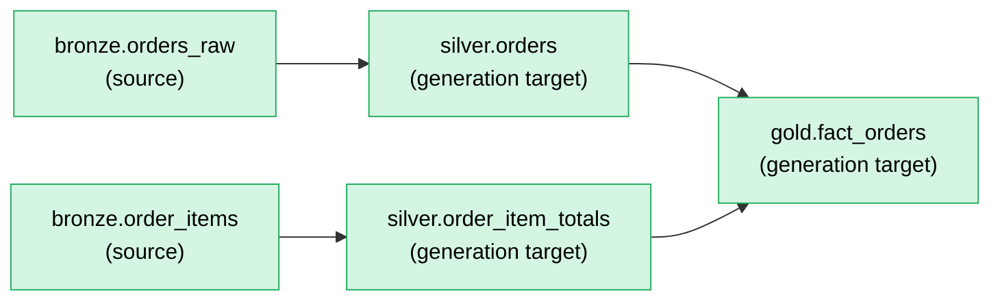

# Blast radius

Regenerated by `python run.py graph`. Reflects metadata vs. `manifest/hash_manifest.json` at the time it was rendered.

**Legend:**
- 🔴 red = metadata changed, template changed, or object is new (direct hit)
- 🟡 yellow = unchanged itself, pulled in because something it `depends_on` changed (propagated impact)
- 🟢 green = untouched, hash matches the manifest, not regenerated

**Clean:** metadata matches the last successful build. Nothing pending.
