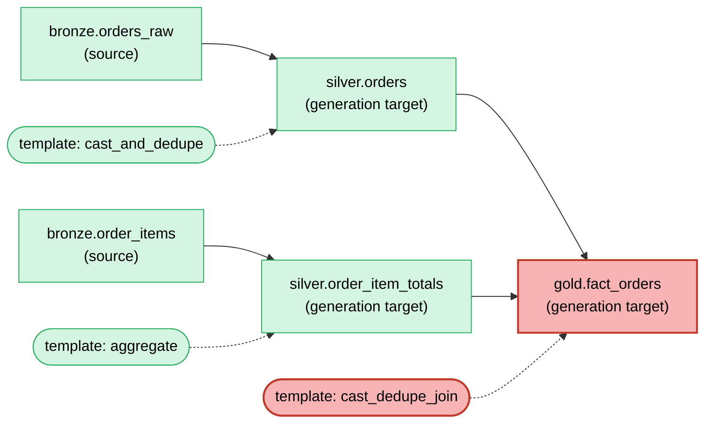

# Blast radius

Regenerated by `python run.py graph`. Reflects metadata + templates vs. `manifest/hash_manifest.json` at the time it was rendered.

**Legend:**
- 🔴 red = metadata changed, template changed, or object/template is new (direct hit)
- 🟡 yellow = unchanged itself, pulled in because something it `depends_on` changed (propagated impact) - only applies to data objects, not templates
- 🟢 green = untouched, hash matches the manifest, not regenerated
- rounded nodes connected by dashed lines are templates, not data objects - an object using a changed template is *itself* red/yellow via the diff engine's own template-hash tracking, independent of this diagram

**Pending:** 1 changed/new, 0 pulled in downstream, 4 untouched.
**Templates changed:** cast_dedupe_join.
Run `python run.py diff` then `python run.py generate` to clear this.
